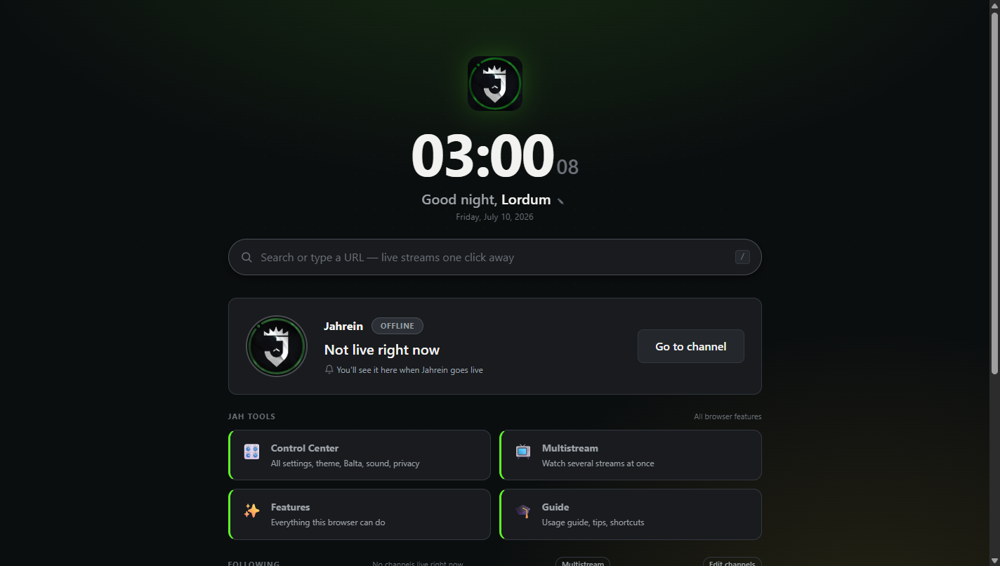
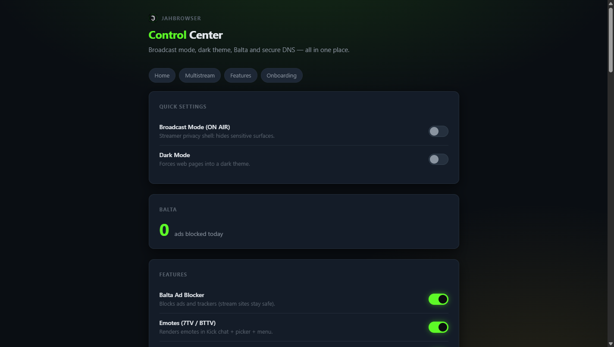
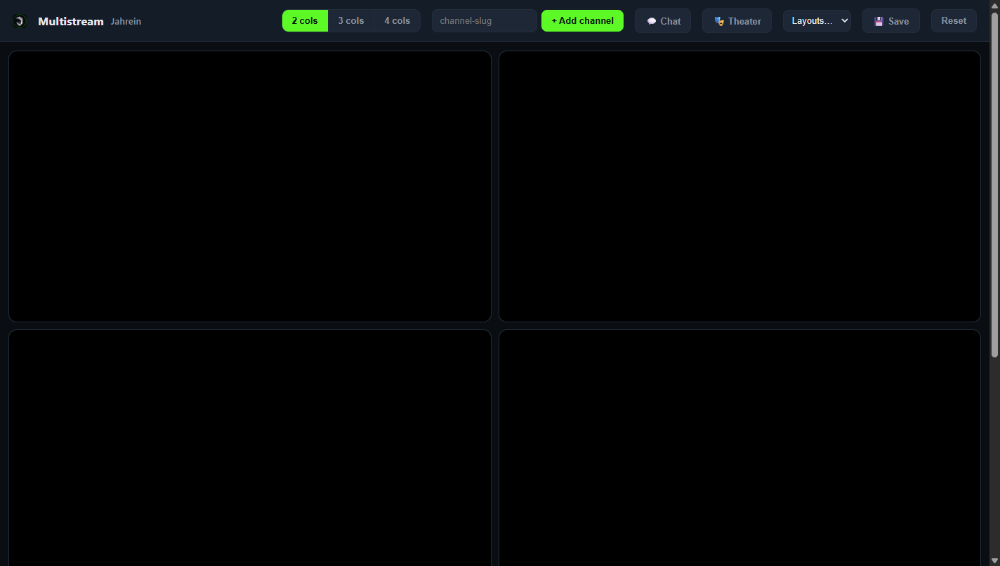

<div align="center">

# JahBrowser

**A crash‑resistant, Chromium‑based Windows browser built for Kick viewers and streamers.**

[](LICENSE)
[]()
[]()

### [](https://github.com/Spectremirac2/JahBrowser/releases/latest/download/JahBrowser-Setup.exe)

**Latest version** · Windows 10/11 · [Portable (.zip)](https://github.com/Spectremirac2/JahBrowser/releases/latest/download/JahBrowser-Portable.zip) · [All releases](../../releases/latest)

[**Why doesn't it crash?**](#-why-doesnt-it-crash) · [**Features**](#-features) · [**Build**](#-build-from-source) · [**Security**](SECURITY.md)

**English** · [**Türkçe**](README.tr.md)



</div>

---

## What is it?

JahBrowser is an open‑source, Chromium‑152‑based Windows browser designed for **Kick** viewers and streamers. Familiar like Chrome, but built for watching live streams — and engineered so **a crash never interrupts your stream.**

- **Crash‑resistant** — even if a tab crashes, your stream keeps going (explained below).
- **No‑plugin emote engine** — 7TV / BTTV / FFZ / Kick emotes render directly in chat.
- **Engine‑level ad blocking (Balta)** — ~93,000 ad/tracker domains + YouTube ad‑skip + cosmetic filtering.
- **Live side panel** — the Kick channels you follow in one place, with real live data.
- **Per‑site volume booster** (0–500%) + loudness normalization, multistream, streamer mode, native Kick mod tools.

<div align="center">


</div>

---

## 🛡️ Why doesn't it crash?

This is JahBrowser's single most important difference. The short answer: **it keeps Chromium's rock‑solid multi‑process core and adds a recovery + protection layer** — so a crash never interrupts your stream.

Chrome is robust too, but when a tab's process crashes it shows you the **"Aw, Snap!"** error page and waits for you to **reload manually**. It also **discards/freezes** background tabs under memory pressure, reloading them from scratch when you return. JahBrowser changes both behaviors. Here is exactly how:

### 1. Invisible automatic crash recovery
If a tab's renderer process actually crashes, JahBrowser **reloads it automatically in a fresh process** instead of showing an error page — usually the page comes back before you even notice.

- **Stream tabs (kick.com) recover fastest (~50 ms);** other tabs ~400 ms.
- **Only genuine crashes** are recovered (process crash, out‑of‑memory, integrity failure). Tabs you closed, or ones the browser evicted to save memory, are never reloaded by mistake.
- **Infinite‑loop protection:** if a page is genuinely broken (keeps crashing), recovery backs off progressively (1 s → 3 s → 10 s) and stops after a threshold, then shows the normal error page — so a broken site can't lock up the browser.
- **Form safety:** pages loaded via POST are never auto‑reloaded — we never silently resubmit your data.

*(Code: `chrome/browser/jah/jah_crash_recovery_tab_helper.cc` — built on `WebContentsObserver::PrimaryMainFrameRenderProcessGone`, shipped in [`chromium-patches/`](chromium-patches/).)*

### 2. Stream tabs are never put to sleep
Most browsers (Chrome included) **freeze/discard** background tabs to reclaim RAM — which is why a stream can go silent while you're on another tab, or reload when you come back.

In JahBrowser, **kick.com tabs are never discarded or frozen** (a `kJahStreamSite` reason was added to Chromium's discard/freeze engine). Memory Saver is on by default — but it only applies to non‑stream tabs. The result: no matter how many tabs you open, your stream keeps playing in the background.

### 3. Video never goes black
If the hardware (GPU) video decoder fails on a driver bug, video **falls back to software decoding and keeps playing** instead of going black (`proprietary_codecs` + `ffmpeg_branding="Chrome"` are compiled together). If the GPU process crashes, Chromium's built‑in safety ladder kicks in — only the **GPU layer**, not the whole browser, drops to a safer mode. The risky flags that would break this ladder (`--ignore-gpu-blocklist`, `--disable-gpu-watchdog`, etc.) are never shipped.

**In short:** same Chromium stability + invisible auto‑recovery + stream‑tab protection + intact GPU ladder = **an uninterrupted stream** for the viewer.

---

## ✨ Features

| Area | Feature |
|---|---|
| **Stability** | Automatic crash recovery · stream‑tab keep‑alive · software video fallback · session restore |
| **Streaming** | Live side panel (real Kick data + avatars) · multistream grid · go‑live desktop notification · Theater (fullscreen) mode |
| **Chat / Emotes** | No‑plugin 7TV/BTTV/FFZ/Kick emote rendering · emote picker + menu · keyword highlight + mention sound · message history |
| **Kick mod tools** | Native mod panel (chatter roster + user‑card · link/spam/flood/CAPS flags · deletion detection) — 100% client‑side |
| **Ads / Privacy** | Balta adblock (~93k domains + cosmetic + YouTube ad‑skip) · DoH on · opt‑in telemetry |
| **Sound** | Per‑site volume booster 0–500% · loudness/normalize · volume mixer popup |
| **Personalization** | Custom new tab (live Kick data) · editable follow list · dark mode · search shortcuts · bilingual (EN/TR) |

Detailed usage guides live in [`docs/kullanim/`](docs/kullanim/).

---

## ⬇️ Download & verify

1. From the [**Releases**](../../releases/latest) page, download `JahBrowser-Setup.exe` (installer) or `JahBrowser-Portable.zip` (portable — extract and run `JahBrowser.bat`).
2. The browser **starts in English by default**; you can switch to Turkish from the Control Center.

### If you see "Windows protected your PC"
JahBrowser is **open source** and currently an **unsigned** independent build. Windows SmartScreen shows this warning for **any** new, unsigned program that hasn't yet built up "reputation" — it does **not** mean the file is a virus. To continue: **"More info" → "Run anyway"**.

You don't have to take our word for it — **verify:**
- Each release publishes **`SHA256SUMS.txt`** so you can check your download's integrity (PowerShell: `Get-FileHash .\JahBrowser-Setup.exe`).
- **VirusTotal scan (clean):** [view the live report ✅](https://www.virustotal.com/gui/url/29779ddaf5f1ef2a94b43d75a85e59a14bfde9501588b15b2670528b33ecdde7/gti-summary) — each release is also scanned by file hash (links in the release notes).
- All source is in this repo — you can [build it yourself](#-build-from-source).

Details: [SECURITY.md](SECURITY.md)

---

## 🔧 Build from source

JahBrowser does not redistribute all of Chromium. Instead it follows the [ungoogled‑chromium](https://github.com/ungoogled-software/ungoogled-chromium) model: **patches applied on top of a clean Chromium tree.**

```
chromium-patches/
  faz1/
    jah-browser-faz1.patch          # main change set (~94 files)
    search-engines-submodule.patch  # search-engine data (separate submodule)
    jah-release-args.gn             # distribution build args template
    tree-files/                     # complete new files that the patch adds
```

Summary (see `chromium-patches/README.md` for detail):

1. Check out a Chromium 152 source tree (base commit `47280b64e3`), install `depot_tools`.
2. Apply the patches: `git apply chromium-patches/faz1/jah-browser-faz1.patch`
3. Create `out/Release/args.gn` from the `jah-release-args.gn` template. **Critical:** for a distribution build, `proprietary_codecs=true` **and** `ffmpeg_branding="Chrome"` must be set together (for video stability).
4. `gn gen out/Release && autoninja -C out/Release chrome mini_installer`

`jah-core/` (engine‑independent product logic, TypeScript) can be tested standalone: `cd jah-core && npm install && npm test`.

---

## 🔒 Privacy

- **Telemetry is off by default** (opt‑in).
- **DoH (DNS‑over‑HTTPS) is on.**
- Streamer privacy mode: designed with "what would leak if this screen were on stream?" in mind.
- Some Google services (like account sync) may not work in open‑source builds without an API key — a known Chromium behavior.

---

## 📄 License & branding

- Code: **BSD 3‑Clause** — see [LICENSE](LICENSE). Chromium and derived components remain under their own licenses.
- This is an **independent community project**, not affiliated with or endorsed by Google, Kick, 7TV, BetterTTV, or FrankerFaceZ. All trademarks belong to their respective owners.
- The "Chrome" name/logo is **not used** (Google trademark).

---

<div align="center">
<sub>Made for the Kick community ❤️ · <a href="README.tr.md">Türkçe README</a></sub>
</div>
